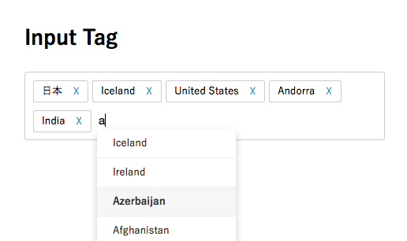

# Input_Tag
自動補完でタグを選択入力できるjQueryプラグイン

[DEMO](http://iritec.github.io/Input_Tag/)

## 使い方
### jQueryとjQuery UI、CSSを読み込む
    
    
    <link rel="stylesheet" href="style.css">

### タグ入力表示部分
    

      

      <input type="text" id="tag-input">
      <input type="hidden" name="skills" id="skills">
    

### 自動補完の選択肢を配列に保存
    
    
### Input_Tagを読み込む
    
    
## 選択されたタグについて
    <input type="hidden" name="skills" id="skills">
にカンマ区切りで入力されます。
